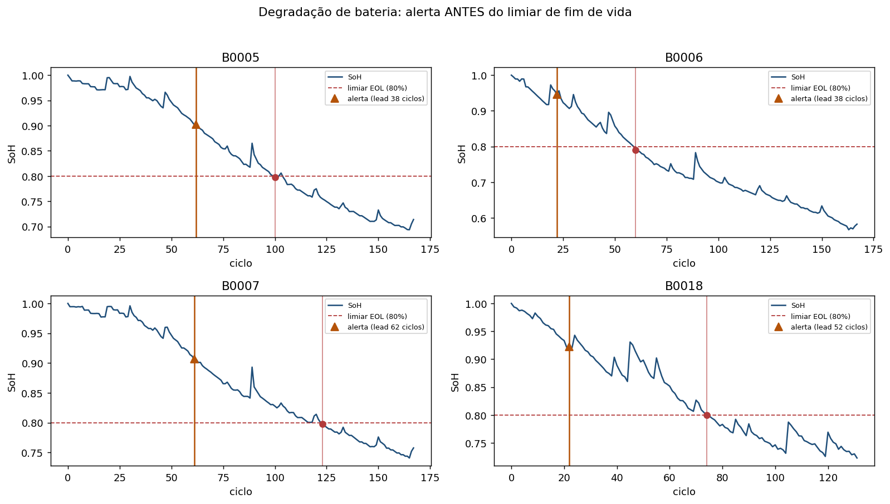
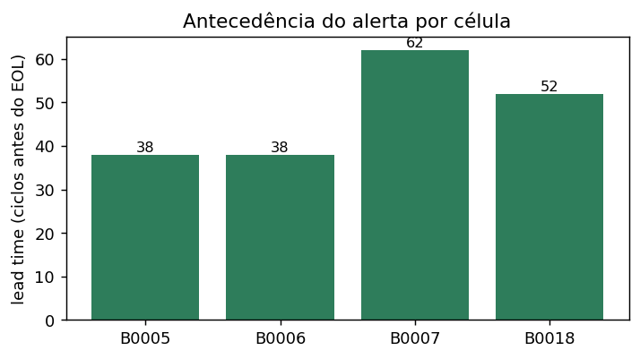

# Desafio #22 — Diagnóstico Preditivo de Bateria (VE): degradação antes do limiar

[](https://colab.research.google.com/github/GuilhermeFrick/ev-battery-early-degradation-poc/blob/main/notebooks/PoC_Bateria_Colab.ipynb)

PoC para o desafio *Diagnóstico Preditivo para Powertrain Elétrico*: **detectar
degradação lenta / "quase-falha" antes de um evento de falha**, provado em **dataset
público rotulado** e depois transferível ao VE do patrocinador.

> **Enquadramento honesto (crítico):** não existe dataset público com DTC de VE real.
> Então a PoC prova *"detecção antes do limiar de degradação (SoH/capacidade/resistência)"*
> — **nunca** *"X dias antes do DTC"*. O DTC fica como rótulo a obter com o patrocinador.
> Base desta decisão: levantamento de datasets (nossa análise + Manus, ago/2026).

## O grande objetivo (em linguagem simples)

Toda bateria envelhece e vai perdendo "saúde" (capacidade) até precisar de manutenção
ou troca. Hoje, o alerta de falha (DTC) normalmente acende **quando o problema já
chegou** — e um veículo parado em rota custa caro. O objetivo é **enxergar a saúde
caindo e avisar com antecedência**, dando tempo de agir **antes da quebra**.

> Analogia: em vez da luz do óleo acender só depois que o motor fundiu, é acompanhar a
> saúde e avisar *"este veículo vai precisar de atenção em breve"*.

**Onde se aplica:**
- **Powertrain elétrico** (bateria, motor, inversor) — o alvo do desafio #22.
- **Gestão de frota:** planejar manutenção e **evitar parada em rota**.
- **Alertas OTA:** aviso remoto *"inspecione este veículo"* antes da falha.
- **Extensível:** o mesmo método serve para o **eixo elétrico** e qualquer componente
  cujo sinal se degrada com o tempo.

## Resultados da PoC (dados reais de bateria — NASA)

Rodamos em 4 baterias reais (B0005/6/7/18). O sistema **detectou a degradação e disparou
o alerta antes** de cada uma cruzar o limiar de fim de vida (SoH 80%), **sem falso alarme**:

| Bateria | Fim de vida (ciclo) | Alerta (ciclo) | **Antecedência (lead time)** |
|---|---:|---:|---:|
| B0005 | 100 | 62 | **38 ciclos** |
| B0006 | 60 | 22 | **38 ciclos** |
| B0007 | 123 | 61 | **62 ciclos** |
| B0018 | 74 | 22 | **52 ciclos** |

**Resumo:** 4/4 alertas antes da falha · **lead time médio ≈ 47 ciclos** (mínimo 38) ·
**0 falsos alarmes**.



*Cada curva é a saúde (SoH) da bateria caindo ao longo do uso. O triângulo laranja é o
**alerta**; o ponto vermelho é quando ela **cruza o limite de fim de vida**. O alerta vem
sempre antes.*



*Quantos ciclos de antecedência o alerta deu em cada bateria — a "folga" para agir.*

> **Leitura honesta:** são 4 baterias — isto **prova o método** (detecção precoce
> confiável), não é ainda um preditor de frota. Aqui o "evento" é o limiar de SoH; no
> produto real, o **DTC do patrocinador** define o evento, e o lead time vira *"antes do DTC"*.

## Estratégia (bateria primeiro; motor como 2ª trilha)
1. **Trilha principal — previsão precoce de fim de vida (Severson/MIT):** prever a vida
   útil (ciclos) a partir dos **primeiros ~100 ciclos**, *antes* de queda visível de
   capacidade. É o análogo mais puro e reproduzível de "detectar degradação cedo".
2. **Camada EV real — anomalia (EVBattery):** detecção de anomalia de saúde em snippets
   de carga de **EVs reais**, com label de anomalia/capacidade.
3. **Estado de saúde contínuo (SoH):** índice de degradação + regra de alerta por limiar,
   com métricas honestas: **lead time** até o limiar e **falsos alarmes por 1.000 ciclos**.

## Datasets (públicos, licença permissiva)
| Dataset | Papel | Licença | Acesso |
|---|---|---|---|
| **Severson/MIT** (data.matr.io) | previsão precoce de vida | CC BY 4.0 | download público (3 batches .mat) |
| **EVBattery** (Figshare) | anomalia em EV real | CC BY 4.0 | download direto (~1,38 GB) |
| NASA PCoE (B0005/6/7/18) | demo rápida de SoH/RUL | citar | S3 direto (pequeno) |

## Como rodar — **Colab-first** (disco local cheio; e requisito do projeto)
O download e o processamento rodam no **Colab** (não no disco local). Abra
`notebooks/PoC_Bateria_Colab.ipynb` pelo badge acima — ele **baixa o NASA automaticamente**
(espelho S3, sem login/upload manual). O repo versiona **só código** — dados nunca.

```bash
# local (se houver espaço em disco):
pip install -r requirements.txt
python scripts/download_data.py --dataset nasa --out data   # baixa e extrai B0005/6/7/18
python src/run_poc.py --data-dir data
```

### Portabilidade Databricks
Código em pandas/numpy com **I/O isolado** (`src/io_data.py`) para trocar leitura local
por DBFS/Spark sem mexer na lógica de modelagem.

## Estrutura
```
desafio22-bateria-ev-degradacao-precoce/
├── data/           # datasets (Colab/Databricks) — NÃO versionado
├── scripts/        # download_data.py (aquisição documentada)
├── src/            # io_data, features, model, evaluate (código da PoC)
├── notebooks/      # PoC_Bateria_Colab.ipynb (via principal)
├── docs/           # documentação + docs/figuras/*.png
└── results/        # saídas (NÃO versionado)
```

## Métricas honestas (protocolo)
- **Split por célula/veículo e por tempo** (nunca embaralhar snippets do mesmo item).
- **Lead time** até cruzar o limiar de degradação (proxy de "antes da falha").
- **Falsos alarmes / 1.000 ciclos** (ou /1.000 km quando houver campo).
- Onde não há falha real: reportar como *"antes do limiar"*, não *"antes do DTC"*.
